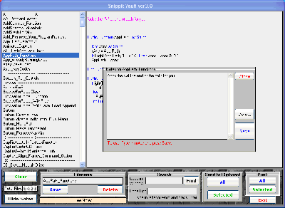



## Snippit Vault

### Description

Use it to store code.You can add notes,do word or title searchs and send to clipboard.Does not use a database, to keep it simple.Hope you find it useful.
 
### More Info
 

             |
---                |---
**Submitted On**   |2008-01-20 09:17:28
**By**             |[Kenneth Foster](https://github.com/Planet-Source-Code/PSCIndex/blob/master/ByAuthor/kenneth-foster.md)
**Level**          |Intermediate
**User Rating**    |5.0 (10 globes from 2 users)
**Compatibility**  |VB 6\.0
**Category**       |[Complete Applications](https://github.com/Planet-Source-Code/PSCIndex/blob/master/ByCategory/complete-applications__1-27.md)
**World**          |[Visual Basic](https://github.com/Planet-Source-Code/PSCIndex/blob/master/ByWorld/visual-basic.md)
**Archive File**   |[Snippit\_Va2098371202008\.zip](https://github.com/Planet-Source-Code/kenneth-foster-snippit-vault__1-69946/archive/master.zip)

